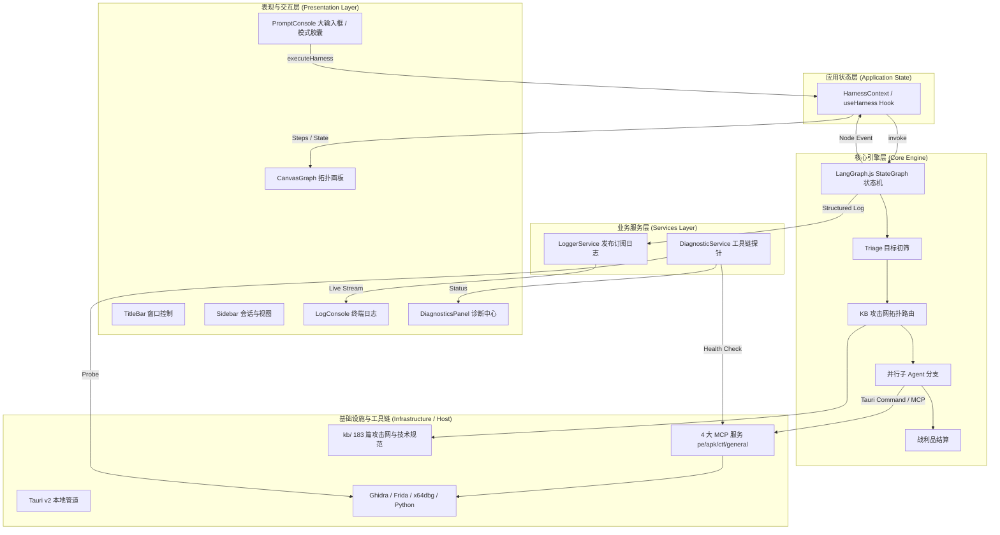

# ReverseLab Desktop Harness — 架构规范说明书 (ARCHITECTURE.md)

本文档定义 `open-reverseLab` 桌面 Harness（AI 逆向工程自动化工作台）的分层解耦架构、数据流转契约与扩展机制。

---

## 1. 架构设计哲学

1. **分层解耦 (Loose Coupling)**：核心状态机与业务逻辑不依赖 React 或 DOM，引擎具备独立在 Node/CLI/Tauri 环境运行的无头 (Headless) 能力。
2. **单一数据源 (Single Source of Truth)**：UI 组件通过 `HarnessContext` 消费与分发状态，禁止跨层 Prop Drilling。
3. **事件驱动 (Event-Driven State)**：工具执行、日志产生、证据捕获均通过强类型的 Event Bus 与 Logger Service 异步派发。
4. **即插即用视图 (Swappable Views)**：拓扑画布 (Graph)、终端日志 (Logs)、全域诊断 (Diagnostics) 作为同级等价视图，随时可横向拓展（如 Disassembly、Hex View）。

---

## 2. 系统拓扑分层

---

## 3. 四层解耦契约

### 3.1 领域契约层 (`src/core/types.ts`)
* 存放不可变接口定义：`GraphStep`、`LogEntry`、`DiagnosticItem`、`SessionItem`、`Deliverables`。
* **绝对规则**：禁止引入任何 UI 库（React, Lucide, Tailwind）或外部框架。

### 3.2 业务服务层 (`src/services/`)
* **`loggerService.ts`**：
  * 基于发布-订阅模式（Pub/Sub）的环形缓冲区日志管理。
  * 提供 `info`、`tool`、`evidence`、`warn`、`error` 五大结构化日志通道。
  * 工具调用强制记录 `command` 与 `durationMs`。
* **`diagnosticService.ts`**：
  * 纯业务探针，负责检测 Python、Ghidra、Frida、x64dbg、DiE 及 4 大 MCP 服务的连通性。

### 3.3 核心引擎层 (`src/engine/`)
* **`harnessGraph.ts`**：
  * 基于 `@langchain/langgraph` 的无头状态机。
  * 通过纯函数形式的 `EventCallback` 发送节点跃迁事件，彻底与 React 渲染解耦。

### 3.4 状态与视图层 (`src/context/` & `src/components/`)
* **`HarnessContext.tsx`**：
  * 汇总 Sessions、Logs、Steps、Diagnostics、Running State。
  * 提供极简 Action API：`executeHarness()`、`runDiagnostics()`、`clearLogs()`、`setViewMode()`。
* **视图组件**：
  * `CanvasGraph`：纯粹渲染 React Flow 节点树。
  * `LogConsole`：纯粹渲染高频虚拟终端日志与搜索过滤。
  * `DiagnosticsPanel`：纯粹展示环境体检与初筛报告。

---

## 4. 模式切换机制 (Mode Capsule)

Harness 提供一体化双模式无缝切换：
1. **许愿闭环模式 (Wish Mode)**：
   * 面向端到端目标全自主达成。
   * 自动规划：初筛 -> 攻击网查表 -> 并行工具调度 -> 战利品脚本生成。
2. **交互诊断模式 (Interactive Mode)**：
   * 面向专家级逐步研判。
   * 支持指令逐步下发、实时日志审查与中间断点干预。
